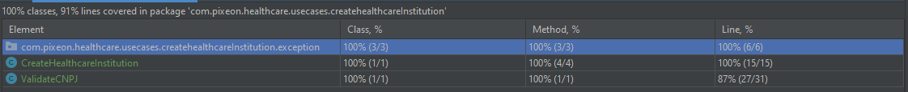

# Pixeon-core
#### Observações
- Como regra de Clean Architecture projeto não pode ter dependências com libs externas, salve unidades de teste.
- A classe [ValidateCNPJ.java](/src/main/java/com/pixeon/healthcare/usecases/createhealthcareInstitution/ValidateCNPJ.java) eu encontrei na internet, fiz algumas refatorações.
## Use Cases  
Como o projeto já tem uma definição de negócio, vamos começar pela implementação dos casos de uso do negócio usado a prática TDD.  
  
  
#### Create a Healthcare
- Permite criar uma nova instituição e adicionar COINs para negociações.

> Requisitos funcionais:
> - Cada nova instituição de saúde deve receber 20 moedas pixeon para salvar os exames e recuperá-los.
> - Resultado: 

#